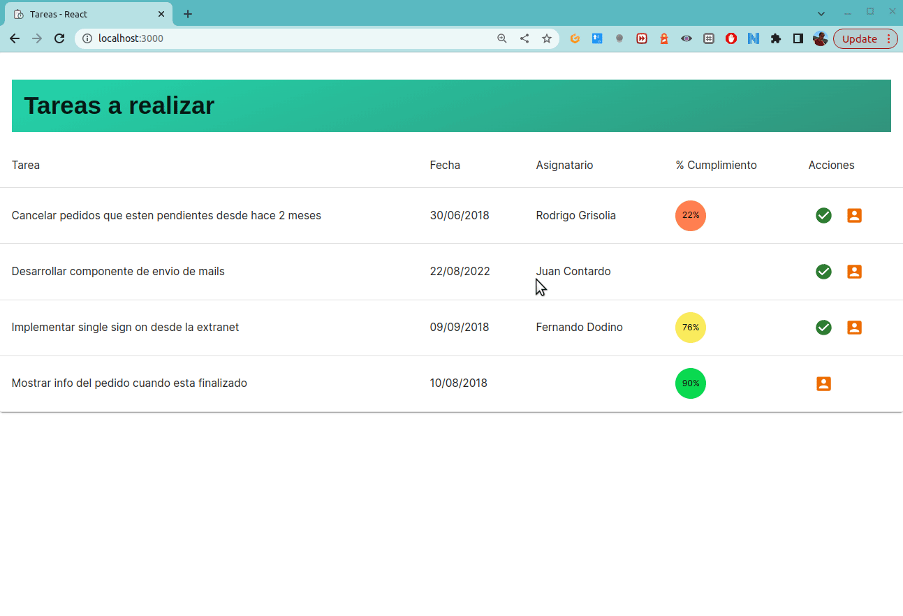

# Tareas de un equipo de desarrollo

[](https://github.com/uqbar-project/eg-tareas-react/actions/workflows/build.yml) 



El ejemplo que muestra las tareas de un equipo de desarrollo, permite asignar, cumplir o modificar la descripción de una tarea.

# Conceptos

- Componentes de React
- Uso de componentes visuales de Material: select (combo), text field, snack bar (message box), tablas, entre otras
- React router que define un master / detail
- Uso de fetch para disparar pedidos asincrónicos tratados con promises
- Manejo del estado

# Arquitectura general

## Página principal: ver tareas


- **TareasComponent**: es el que sabe mostrar la tabla y delega en TareaRow la visualización de cada ítem
- **TareaRow**: conoce cómo mostrar una tarea dentro de una fila de la tabla
- **PorcentajeCumplimiento**: es un componente que muestra un avatar con el % de cumplimiento en diferentes colores. En rojo se visualizan las tareas cuyo % de cumplimiento es menor a 50, luego de 50 a 90% exclusive aparecen en amarillo y por último las que tienen 90% ó más se ven en verde.


En el componente que muestra las tareas disparamos la búsqueda de tareas (evento `componentDidMount` porque `tareas` está definido como clase):

```js
  async componentDidMount() {
    //debugger //  to show lifecycle
    await this.traerTareas()
  }

  traerTareas = async () => {
    try {
      const tareas = await tareaService.allInstances()
      ...
```

El service hace la llamada asincrónica al backend utilizando la biblioteca [Axios](https://github.com/axios/axios), transformando la lista de objetos JSON en objetos Tarea y ordenándolas por descripción:

```js
class TareaService {
  async allInstances() {
    const tareasJson = await axios.get(`${REST_SERVER_URL}/tareas`)
    const tareas = tareasJson.data.map((tareaJson) => Tarea.fromJson(tareaJson)) // o ... this.tareaAsJson
    return tareas.sort((a, b) => (a.descripcion < b.descripcion ? -1 : 1)) // las ordenamos por descripción
  }
```

Cuando el pedido vuelve con un estado ok, se actualiza el estado del componente React:

```js
class TareasComponent {

  traerTareas = async () => {
    try {
      const tareas = await tareaService.allInstances()
      this.setState({
        tareas, // recordemos que equivale a tareas: tareas,
      })
    } catch (error) {
      this.setState({ errorMessage: obtenerMensaje(error) })
    }
  }
```

También podríamos utilizar la sintaxis de promises común `then().catch()`.

```js
traerTareas() {
  tareaService.allInstances()
    .then((tareas) => {
      this.setState({
        tareas,
      })
    })
    .catch ((error) => {
      this.setState({ errorMessage: obtenerMensaje(error) })
    })
}
```

## Cumplir una tarea

El componente `TareaRow` captura el evento del botón:

```js
export const TareaRow = (props) => {

  <IconButton aria-label="Cumplir" onClick={cumplirTarea}>
      <CheckCircleIcon />
  </IconButton>
```

En el método del componente delegamos el cumplimiento al objeto de dominio Tarea y pedimos al service que actualice el backend. Cuando la promise se cumple, disparamos la función que nos pasaron por props para buscar nuevamente las tareas al backend, así traemos la última información:

```js
// en el componente funcional TareaRow
const cumplirTarea = async () => {
    // debugger // para mostrar que no se cambia la ui despues de hacer tarea.cumplir()
    try {
        tarea.cumplir()
        await tareaService.actualizarTarea(tarea)
    } catch (error) {
        generarError(error)
    } finally {
        // independientemente de si anduvo bien o no actualizamos la información del backend
        await actualizar()
    }
}
```

`props.actualizar()` lo recibimos como una función en el componente `TareaRow`:

```js
// en Tarea se envía para cada uno de los elementos de la lista
<TareaRow
  tarea={tarea}
  key={tarea.id}
  actualizar={this.traerTareas} />)
```

```js
TareaRow.propTypes = {
    tarea: PropTypes.instanceOf(Tarea),
    navigate: PropTypes.func,
    actualizar: PropTypes.func,
}
```

El método traerTareas ya lo hemos visto, es el que se dispara inicialmente en el evento componentDidMount de `Tarea`.

Por su parte, el método actualizarTarea del service dispara el pedido PUT al backend, pasando como body la conversión de nuestro objeto de dominio Tarea a JSON:

```js
actualizarTarea(tarea) {
  return axios.put(`${REST_SERVER_URL}/tareas/${tarea.id}`, tarea.toJSON())
}
```

## Asignación de tareas

### Navegación

El botón de asignación dispara la navegación de la ruta '/asignarTarea' (en TareaRow):

```js
const goToAsignarTarea = () => {
    navigate(`/asignarTarea/${tarea.id}`)
}
```

`navigate` es una función que recibimos cuando decoramos nuestro componente `TareaRow` al exportarlo:

```js
export default withRouter(TareaRow)
```

`withRouter` es una función que estaba originalmente en react-router pero que ahora tuvimos que agregar manualmente, y permite recibir un componente y **decorarlo** pasándole como prop la función `useNavigate` que nosotros llamamos `navigate` y que sirve para movernos de página:

```js
export const withRouter = (Component) => {
  const Wrapper = (props) => {
    const navigate = useNavigate()
    
    return (
      <Component
        navigate={navigate}
        {...props}
        />
    )
  }
  
  return Wrapper
}
```

A su vez, en el archivo `routes.js` definimos que el path `/asignarTarea/:id` se mapea con el componente de React que permite asignar la tarea:

```js
export const TareasRoutes = () => 
    <Router>
        <Routes>
            <Route exact={true} path="/" element={<TareasComponent/>} />
            <Route path="/asignarTarea/:id" element={<AsignarTareaComponent/>} />
        </Routes>
    </Router>
```

Para más información pueden ver [esta página del Router de React](https://reactrouter.com/docs/en/v6).


### Llamadas asincrónicas

En la asignación de tareas el combo de usuarios se llena con una llamada al servicio REST que trae los usuarios:

```js
class UsuarioService {

  async allInstances() {
    const { data } = await axios.get(`${REST_SERVER_URL}/usuarios`)
    // { data } aplica destructuring sobre el objeto recibido por la promise, es equivalente a hacer
    // const response = await ...
    // return response.data
    return data
  }
```

Además de los usuarios, agregamos en el combo la opción "Sin Asignar", para poder desasignar una tarea (lo tenemos que asociar a un valor en blanco):

```js
<Select
    value={this.state.tarea.nombreAsignatario}
    onChange={(event) => this.asignar(event.target.value)}
    className="formControl"
    inputProps={{
        name: 'asignatario',
        id: 'asignatario'
    }}
>
    >
        <MenuItem value=" ">
        <em>Sin Asignar</em>
    </MenuItem>
    {this.state.usuarios.map(usuario => <MenuItem value={usuario.nombre} key={usuario.id}>{usuario.nombre}</MenuItem>)}
</Select>
```

La clase formControl especifica un width más grande (el default es muy chico), en el archivo `index.css`:

```css
.formControl {
  width: 35rem;
  min-width: 35rem;
}
```

Para entender cómo funciona la asignación, el combo dispara el evento de cambio al componente AsignarTareas:

```js
... onChange={(event) => this.asignar(event.target.value)}
```

El método asignar recibe el nombre del nuevo asignatario (podríamos recibir el identificador, pero lamentablemente el servicio REST solo nos da el nombre), entonces delegamos a un método más general que actualiza el estado de la tarea. En el componente AsignarTareaComponent:

```js
asignar = (asignatario) => {
  const tarea = this.state.tarea
  const asignatarioNuevo = asignatario.trim() ? asignatario : null
  tarea.asignarA(asignatarioNuevo)
  this.cambiarEstado(tarea)
}

cambiarEstado = (tarea) => {
  // generamos una copia de la tarea, sabiendo que no necesita una copia profunda
  const newTarea = Object.assign(tarea)
  this.setState({
    tarea: newTarea,
    errorMessage: '',
  })
}
```

Un detalle importante es que no podemos hacer la copia de la tarea utilizando el _spread operator_ (`{...tarea}`) porque solo copia los atributos del objeto y no sus métodos. Pueden investigar más en [este link](https://www.javascripttutorial.net/object/3-ways-to-copy-objects-in-javascript/).

Al actualizar el estado se dispara el render que refleja el nuevo valor para el combo, y tenemos entonces siempre la tarea actualizada.

### Aceptar los cambios de la asignación

Cuando el usuario presiona el botón Aceptar, se dispara el evento asociado que delega la actualización al service y regresa a la página principal.

```js
aceptarCambios = async () => {
  try {
    this.state.tarea.validarAsignacion()
    await tareaService.actualizarTarea(this.state.tarea)
    this.volver()
  } catch (e) {
    this.generarError(e)
  }
}
```

Se delega la validación en la tarea directamente. Pueden ver la implementación en el código.

## Keys de componentes custom en un loop

Veamos el código que muestra la lista de tareas:

```js
  <TableBody data-testid="resultados">
    {
      this.state.tareas.map((tarea) =>
        <TareaRow
          tarea={tarea}
          key={tarea.id}
          actualizar={this.traerTareas} />)
    }
  </TableBody>
```

Como lo cuenta [la documentación de React](https://es.reactjs.org/docs/lists-and-keys.html), es importante dar a cada uno de nuestros componentes custom (`TareaRow` en este caso) una **key** para identificar rápidamente qué componentes están asociados a un cambio de estado (el Virtual DOM interno que maneja React). La restricción que deben cumplir los componentes hermanos es que a) sus **key** sean únicas, b) que existan.

Si eliminamos la línea que genera la key, el Linter de React nos muestra un mensaje de error: `Missing "key" prop for element in iterator`. Pero qué ocurre si definimos una clave constante, como por ejemplo `1`:

```js
<TableBody data-testid="resultados">
  {
    this.state.tareas.map((tarea) =>
      <TareaRow
        tarea={tarea}
        key={1}
        actualizar={this.traerTareas} />)
  }
</TableBody>
```

- por un lado en la consola nos aparece un error en runtime, donde nos alerta que definir la misma clave puede producir inconsistencias en las actualizaciones de la página
- por otro lado, cuando cumplimos una tarea, se actualizan innecesariamente todas las filas de la tabla. Podría pasar incluso que se actualice la información de las filas incorrectas

La necesidad de trabajar con **key** únicas entre hermanos solo es necesaria cuando tenemos un loop, una iteración (no ocurre cuando estamos definiendo un componente solo).

# Testing

Ahora que separamos todo en componentes más chicos y con menos responsabilidades, son mucho más fáciles de testear :tada:

## TareaRow

A este componente le pasamos una tarea por `props` y basándonos en los diferentes estados de la misma hacemos lo siguiente:

- si está asignada nos aparece el botón que permite marcarla como cumplida
- si está asignada pero su porcentaje de cumplimiento está completo no aparece el botón cumplir
- cuando tocamos el botón asignar nos redirige hacia otra página
- si no está asignada no aparece dicho botón

El lector puede ver la implementación en el archivo [tareaRow.spec.js](./src/components/tareas/tareaRow/tareaRow.spec.js), vamos a detenernos en dos detalles de implementación nuevos. El primero es que la función `getByTestId` tira error si el elemento que buscamos no existe, por ese motivo usamos `queryByTestId` del objeto `screen`:

```js
test('si su porcentaje de cumplimiento está completo NO se puede asignar', () => {
  tareaAsignada.cumplir()
  render(<BrowserRouter><TareaRow tarea={tareaAsignada} /></BrowserRouter>)
  expect(screen.queryByTestId('cumplir_' + tareaAsignada.id)).toBeNull()
})
```

Y el segundo es que usamos un **spy** para escuchar a qué ruta nos dirigimos cuando la asignación se hizo correctamente:

```js
...
const mockedNavigate = vi.fn()
vi.mock('react-router-dom', async () => {
    const mockedRouter = await vi.importActual('react-router-dom')

    return {
        ...mockedRouter,
        useNavigate: () => mockedNavigate,
    }
})

...

test('y se clickea el boton de asignacion, nos redirige a la ruta de asignacion con el id de la tarea', async () => {
  render(
    <BrowserRouter>
      <TareaRow
        tarea={tareaAsignada}
      />
    </BrowserRouter>
  )

  await userEvent.click(screen.getByTestId('asignar_' + tareaAsignada.id))
  expect(mockedNavigate).toBeCalledWith(`/asignarTarea/${tareaAsignada.id}`)
})
```

## Tareas

### Mockear el servicio

La parte más interesante de los tests es cómo hacemos para interceptar las llamadas a nuestros **services**, lo primero es crear nuestros datos de mock (pueden ver la implementación en el archivo [crearTarea.js](./src/testsUtils/crearTarea.js)). Y ahora sí podemos construir una _promise mockeada_, dentro de nuestros tests. Como nuestro servicio de tareas es un singleton, podemos pisar el método en el contexto de los tests haciendo que devuelva una promesa con lo que nosotros queramos directamente, de la siguiente manera:

```js
tareaService.allInstances = () => Promise.resolve(mockTareas)
```

Y nuestro test queda de la siguiente forma :

```js
describe('cuando el servicio responde correctamente', () => {
  test('se muestran las tareas en la tabla', async () => {
    tareaService.allInstances = () => Promise.resolve(mockTareas)
    render(<BrowserRouter><TareasComponent /></BrowserRouter>)
    expect(await screen.findByTestId('tarea_159')).toBeInTheDocument()
    expect(await screen.findByTestId('tarea_68')).toBeInTheDocument()
  })
})
```

De todas maneras este approach nos deja el comportamiento de tareaService fijo para que siempre devuelva `mockTareas`. **Si queremos que luego del test vuelva a su comportamiento original deberíamos utilizar el mock que nos proporciona `vi`**.

Es necesario envolver TareasComponent en el **BrowserRouter** para recibir la navegación y que funcione correctamente.
