# Tareas de un equipo de desarrollo

[](https://github.com/uqbar-project/eg-tareas-react/actions/workflows/build.yml) [](https://codecov.io/gh/uqbar-project/eg-tareas-react)

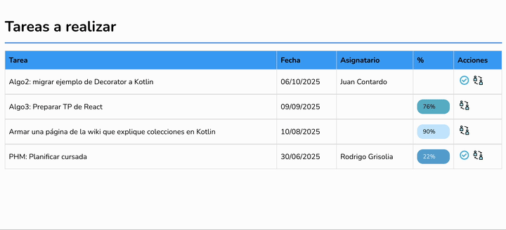

El ejemplo que muestra las tareas de un equipo de desarrollo, permite asignar, cumplir o modificar la descripción de una tarea.

# Conceptos

- Componentes de React
- Uso y definición de componentes visuales
- Definición de un toast para mostrar mensajes de error y una función genérica para obtener un mensaje de error
- React router que define un master / detail
- Uso de axios para disparar pedidos asincrónicos tratados con promises
- Manejo del estado

# Arquitectura general

## Página principal: ver tareas

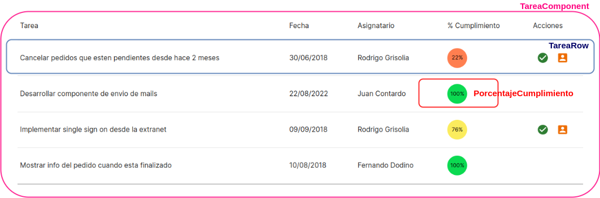

- **TareasComponent**: es el que sabe mostrar la tabla y delega en TareaRow la visualización de cada ítem
- **TareaRow**: conoce cómo mostrar una tarea dentro de una fila de la tabla
- **PorcentajeCumplimiento**: es un componente que muestra un avatar con el % de cumplimiento en diferentes colores. En rojo se visualizan las tareas cuyo % de cumplimiento es menor a 50, luego de 50 a 90% exclusive aparecen en amarillo y por último las que tienen 90% ó más se ven en verde.

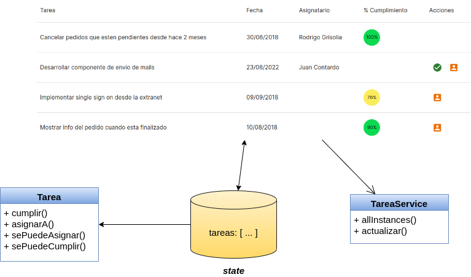

A través de nuestro _custom hook_ useOnInit disparamos la búsqueda de tareas:

```ts
  const traerTareas = async () => {
    try {
      const tareas = await tareaService.allInstances()
      setTareas(tareas)
    } catch (error: unknown) {
      const errorMessage = getMensajeError(error as ErrorResponse)
      showToast(errorMessage, 'error')
    }
  }

  useOnInit(traerTareas)
```

Definimos la función aparte para poder usarla como prop a nuestro componente hijo.

El service hace la llamada asincrónica al backend utilizando la biblioteca [Axios](https://github.com/axios/axios), transformando la lista de objetos JSON en objetos Tarea y ordenándolas por descripción:

```ts
class TareaService {
  async allInstances() {
    const tareasJson = await axios.get(`${REST_SERVER_URL}/tareas`)
    const tareas = tareasJson.data.map((tareaJson) => Tarea.fromJson(tareaJson)) // o ... this.tareaAsJson
    return tareas.sort((a, b) => a.descripcion < b.descripcion ? -1 : 1)
  }
```

Cuando el pedido vuelve con un estado ok, se actualiza el estado del componente React: `setTareas(tareas)`

También podríamos utilizar la sintaxis de promises común `then().catch()`.

```ts
traerTareas() {
  tareaService.allInstances()
    .then((tareas) => {
      setTareas(tareas)
    })
    .catch ((error: unknown) => {
      const errorMessage = getMensajeError(error as ErrorResponse)
      showToast(errorMessage, 'error')
    })
}
```

## Cumplir una tarea

El componente `TareaRow` captura el evento del botón:

```js
export const TareaRow = ({ tarea, actualizar }: { tarea: Tarea, actualizar: () => void }) => {

  const cumplirButton = tarea.sePuedeCumplir() &&
    

```

En el método del componente delegamos el cumplimiento al objeto de dominio Tarea y pedimos al service que actualice el backend. Cuando la promise se cumple, disparamos la función que nos pasaron por props para buscar nuevamente las tareas al backend, así traemos la última información:

```ts
// en el componente funcional TareaRow
  const cumplirTarea = async () => {
    // debugger // para mostrar que no se cambia la ui despues de hacer tarea.cumplir()
    try {
      tarea.cumplir()
      await tareaService.actualizarTarea(tarea)
    } catch (error: unknown) {
      const errorMessage = getMensajeError(error as ErrorResponse)
      showToast(errorMessage, 'error')
    } finally {
      // viene como props
      await actualizar()
    }
  }
```

`TareaComponent` le pasa la función al componente `TareaRow`:

```js
// en Tarea se envía para cada uno de los elementos de la lista
tareas.map((tarea) =>
  <TareaRow
    tarea={tarea}
    key={tarea.id}
    actualizar={traerTareas} />)
```

El método traerTareas ya lo hemos visto, es el que se dispara inicialmente en el componente principal.

Por su parte, el método actualizarTarea del service dispara el pedido PUT al backend, pasando como body la conversión de nuestro objeto de dominio Tarea a JSON:

```ts
  actualizarTarea(tarea: Tarea) {
    return axios.put(`${REST_SERVER_URL}/tareas/${tarea.id}`, tarea.toJSON())
  }
```

## Asignación de tareas

### Navegación

El botón de asignación dispara la navegación de la ruta '/asignarTarea' (en TareaRow):

```ts
const goToAsignarTarea = () => {
    navigate(`/asignarTarea/${tarea.id}`)
}
```

`navigate` es una función que obtenemos mediante el hook _useNavigate_:

```ts
const navigate = useNavigate()
```

A su vez, en el archivo `routes.js` definimos que el path `/asignarTarea/:id` se mapea con el componente de React que permite asignar la tarea:

```ts
export const TareasRoutes = () =>
    <Routes>
        <Route path="/" element={<TareasComponent />} />
        <Route path="/asignarTarea/:id" element={<AsignarTareaComponent />} />
    </Routes>

export const TareasRouter = () =>
    <Router>
        <TareasRoutes />
    </Router>
```

Para más información pueden ver [esta página del Router de React](https://reactrouter.com/en/main).

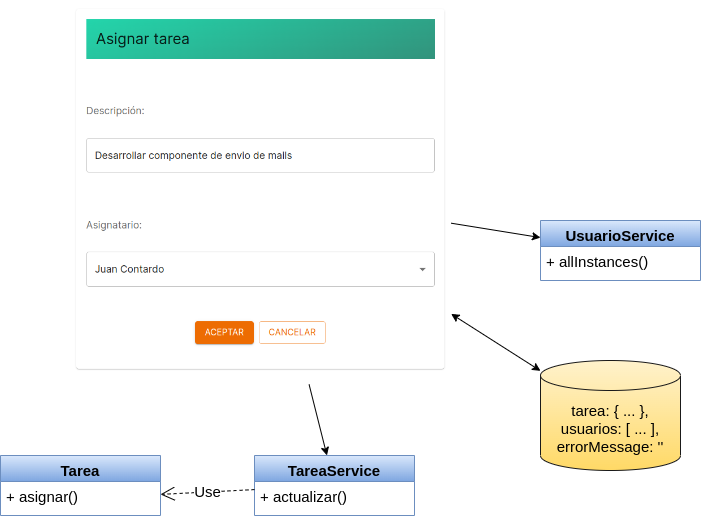

### Llamadas asincrónicas

En la asignación de tareas el combo de usuarios se llena con una llamada al servicio REST que trae los usuarios:

```ts
class UsuarioService {

  async allInstances() {
    const { data } = await axios.get(`${REST_SERVER_URL}/usuarios`)
    // { data } aplica destructuring sobre el objeto recibido por la promise, es equivalente a hacer
    // const response = await ...
    // return response.data
    return data
  }
```

Además de los usuarios, agregamos en el combo la opción "Sin Asignar", para poder desasignar una tarea (lo tenemos que asociar a un valor en blanco):

```js
<select
  /* Acá podemos ver cómo esta declarado nombreAsignatario */
  value={tarea.nombreAsignatario ?? ' '}
  onChange={(event) => asignar(event.target.value)}
  className="formControl"
  title="asignatario"
  name="asignatario"
  data-testid="asignatario"
>
  <option value=" ">
    Sin Asignar
  </option>
  {usuarios.map(usuario => <option value={usuario.nombre} key={usuario.nombre}>{usuario.nombre}</option>)}
</select>
```

Para entender cómo funciona la asignación, el combo dispara el evento de cambio al componente AsignarTareas:

```ts
... onChange={(event) => asignar(event.target.value)}
```

El método asignar recibe el nombre del nuevo asignatario (podríamos recibir el identificador, pero lamentablemente el servicio REST solo nos da el nombre), entonces delegamos a un método más general que actualiza el estado de la tarea. En el componente AsignarTareaComponent:

```ts
  const asignar = (asignatario: string) => {
    const asignatarioNuevo = usuarios.find((usuario) => usuario.nombre === asignatario)
    tarea.asignarA(asignatarioNuevo!)
    generarNuevaTarea(tarea)
  }

  const generarNuevaTarea = (tarea: Tarea) => {
    const nuevaTarea = Object.assign(new Tarea(), tarea)
    setTarea(nuevaTarea)
  }
```

Un detalle importante es que no podemos hacer la copia de la tarea utilizando el _spread operator_ (`{...tarea}`) porque solo copia los atributos del objeto y no sus métodos. Pueden investigar más en [este link](https://www.javascripttutorial.net/object/3-ways-to-copy-objects-in-javascript/).

Al actualizar el estado se dispara el render que refleja el nuevo valor para el combo, y tenemos entonces siempre la tarea actualizada.

### Aceptar los cambios de la asignación

Cuando el usuario presiona el botón Aceptar, se dispara el evento asociado que delega la actualización al service y regresa a la página principal.

```ts
  const aceptarCambios = async () => {
    try {
      tarea.validarAsignacion()
      await tareaService.actualizarTarea(tarea)
      volver()
    } catch (error: unknown) {
      const errorMessage = getMensajeError(error)
      showToast(errorMessage, 'error')
    }
  }
```

Se delega la validación en la tarea directamente. Pueden ver la implementación en el código.

## Keys de componentes custom en un loop

Veamos el código que muestra la lista de tareas:

```tsx
<tbody data-testid="resultados">
  {
    tareas.map((tarea) =>
      <TareaRow
        tarea={tarea}
        key={tarea.id}
        actualizar={traerTareas} />)
  }
</tbody>
```

Como lo cuenta [la documentación de React](https://es.react.dev/learn/rendering-lists), es importante dar a cada uno de nuestros componentes custom (`TareaRow` en este caso) una **key** para identificar rápidamente qué componentes están asociados a un cambio de estado (el Virtual DOM interno que maneja React). La restricción que deben cumplir los componentes hermanos es que a) sus **key** sean únicas, b) que no cambien durante el flujo de trabajo, ya que es lo que React utiliza para poder ubicar un componente en el DOM de HTML. Si trabajamos con el índice o con un valor al azar (`Math.random`) eso hace que cada vez que se dispare el render haya que redibujar toda la tabla. [Este artículo](https://kuldipem.medium.com/say-no-to-array-index-as-key-in-react-my-approaches-to-tackle-it-that-you-can-use-51153bfa8901) cuenta alternativas, entre los que se incluye un hook propio de React: `useId()`.

Si eliminamos la línea que genera la key, el Linter de React nos muestra un mensaje de error: `Missing "key" prop for element in iterator`. Pero qué ocurre si definimos una clave constante, como por ejemplo `1`:

```tsx
<tbody data-testid="resultados">
  {
    tareas.map((tarea) =>
      <TareaRow
        tarea={tarea}
        key={1}
        actualizar={traerTareas} />)
  }
</tbody>
```

- por un lado en la consola nos aparece un error en runtime, donde nos alerta que definir la misma clave puede producir inconsistencias en las actualizaciones de la página
- por otro lado, cuando cumplimos una tarea, se actualizan innecesariamente todas las filas de la tabla.

La necesidad de trabajar con **key** únicas entre hermanos solo es necesaria cuando tenemos un loop, una iteración (no ocurre cuando estamos definiendo un componente solo).

> Te dejamos un [muy buen video](https://www.youtube.com/watch?v=A8AxHueElo0) que explica lo que pasa cuando elegís una `key` mala (como el `index` de los elementos que recorrés) y además si tus componentes hermanos tienen estado.

# Testing

Ahora que separamos todo en componentes más chicos y con menos responsabilidades, son mucho más fáciles de testear :tada:

## TareaRow

A este componente le pasamos una tarea por `props` y basándonos en los diferentes estados de la misma hacemos lo siguiente:

- si está asignada nos aparece el botón que permite marcarla como cumplida
- si está asignada pero su porcentaje de cumplimiento está completo no aparece el botón cumplir
- cuando tocamos el botón asignar nos redirige hacia otra página
- si no está asignada no aparece dicho botón

El lector puede ver la implementación en el archivo [tareaRow.test.tsx](./src/components/tareas/tareaRow/tareaRow.test.tsx), vamos a detenernos en dos detalles de implementación nuevos. El primero es que la función `getByTestId` tira error si el elemento que buscamos no existe, por ese motivo usamos `queryByTestId` del objeto `screen`:

```ts
test('si su porcentaje de cumplimiento está completo NO se puede asignar', () => {
  tareaAsignada.cumplir()
  render(<BrowserRouter><TareaRow tarea={tareaAsignada} actualizar={() => { }} /></BrowserRouter>)
  expect(screen.queryByTestId('cumplir_' + tareaAsignada.id)).toBeNull()
})
```

Y el segundo es que usamos un **spy** para escuchar a qué ruta nos dirigimos cuando la asignación se hizo correctamente:

```js
...
const mockedNavigate = vi.fn()
vi.mock('react-router-dom', async () => {
  const mockedRouter = await vi.importActual('react-router-dom')

  return {
    ...mockedRouter,
    useNavigate: () => mockedNavigate,
  }
})

...

test('y se clickea el boton de asignacion, nos redirige a la ruta de asignacion con el id de la tarea', async () => {
  render(
    <BrowserRouter>
      <TareaRow
        tarea={tareaAsignada}
      />
    </BrowserRouter>
  )

  await userEvent.click(screen.getByTestId('asignar_' + tareaAsignada.id))
  expect(mockedNavigate).toBeCalledWith(`/asignarTarea/${tareaAsignada.id}`)
})
```

Para el testeo de la página de Asignación, en lugar de `BrowserRouter` elegimos `MemoryRouter` que simula fácilmente la navegación hacia la página de asignación.

## Tareas

### Mockear la llamada a Axios

La parte más interesante de los tests es cómo hacemos para interceptar las llamadas a Axios (en lugar de hacerlo a nuestros **services**). De esa manera incluimos a los servicios dentro del test de frontend.

```tsx
const mockTareas =
  [
    {
      id: 68, 
      descripcion: 'Desarrollar TODO List en React', 
      porcentajeCumplimiento: 75, 
      asignadoA: 'Paula Paretto'
    },
    ...
  ]

describe('TareasComponent', () => {

  beforeEach(() => {
    vi.mock('axios')
    const spyGetAxios = vi.spyOn(axios, 'get')

    // se mockea cada respuesta del server
    spyGetAxios.mockResolvedValueOnce({
      data: mockTareas
    })
  })
```

De todas maneras este approach nos deja el comportamiento de Axios fijo para que siempre devuelva `mockTareas`. **Si queremos que luego del test vuelva a su comportamiento original deberíamos utilizar el mock que nos proporciona `vi`**:

```ts
  describe('cuando el servicio responde correctamente', () => {
    test('se muestran las tareas en la tabla', async () => {
      render(<BrowserRouter><TareasComponent /></BrowserRouter>)
      await waitFor(() => {
        expect(screen.getByTestId('tarea_159')).toBeTruthy()
        expect(screen.getByTestId('tarea_68')).toBeTruthy()
      })
    })
  })

  afterEach(() => {
    vi.restoreAllMocks()
  })
```

Al final de la ejecución de los tests llamamos a la función que nos permite recuperar el estado original de nuestro service, en caso de que tengamos más tests que necesiten la implementación verdadera.

Por último, es necesario envolver TareasComponent en el **BrowserRouter** para recibir la navegación y que funcione correctamente.

___

## Qué pasa cuando tenemos mucha información

En esta rama vamos a analizar cómo trabajar cuando tenemos que manipular mucha información del lado del frontend.

Cambiamos nuestro backend a [este ejemplo que está hecho en Node](https://github.com/uqbar-project/eg-tareas-node) pero que además

- crea más de 450 tareas
- y ofrece "paginar" la información: esto significa que podemos pasar como parámetro **page** y **limit**, de manera de traer las primeras 10 tareas, o la página 3 tomando de a 25 tareas como límite, lo que nos daría las tareas que se ubiquen en el orden 51 al 75

Si no le pasamos el valor para el parámetro límite, nos devuelve la lista completa de 450 tareas. Bastante, no?

## Analizando la performance

### Lighthouse - Navigation

Para poder medir el rendimiento, vamos a activar las herramientas de desarrollo (F12) en el navegador. Verifiquemos que en la solapa Network tengamos desactivado el cache:

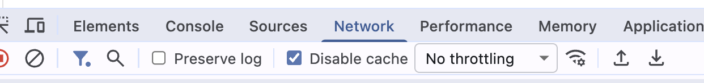

Luego vamos a la solapa Lighthouse, que es la herramienta que trae Chrome para medir la performance. Si tu navegador por defecto es otro, hay cosas similares para Firefox (solapa Performance), Safari (paneles Timelines/Performance) y Edge (Performance/Memory). Desde allí seleccionamos "Navigation", solo el check "Performance", la opción "Desktop" y luego "Analyze page load"

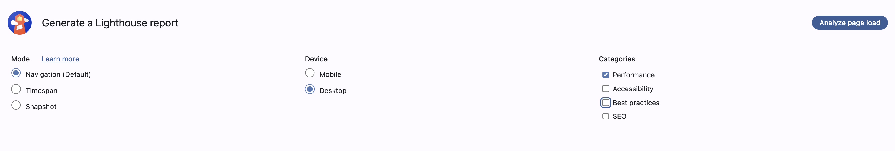

Como resultado tendremos un % de 0 a 100, que variará entre 70 y 85 aproximadamente:

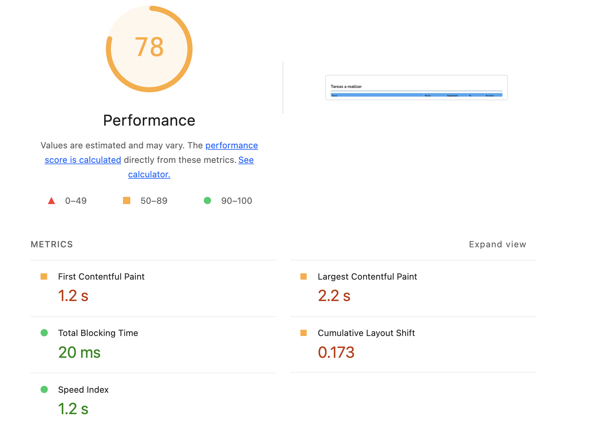

- TODO: contar FCP y LCP

### Lighthouse - Snapshot

Si seleccionamos la opción "Snapshot", veremos el siguiente reporte

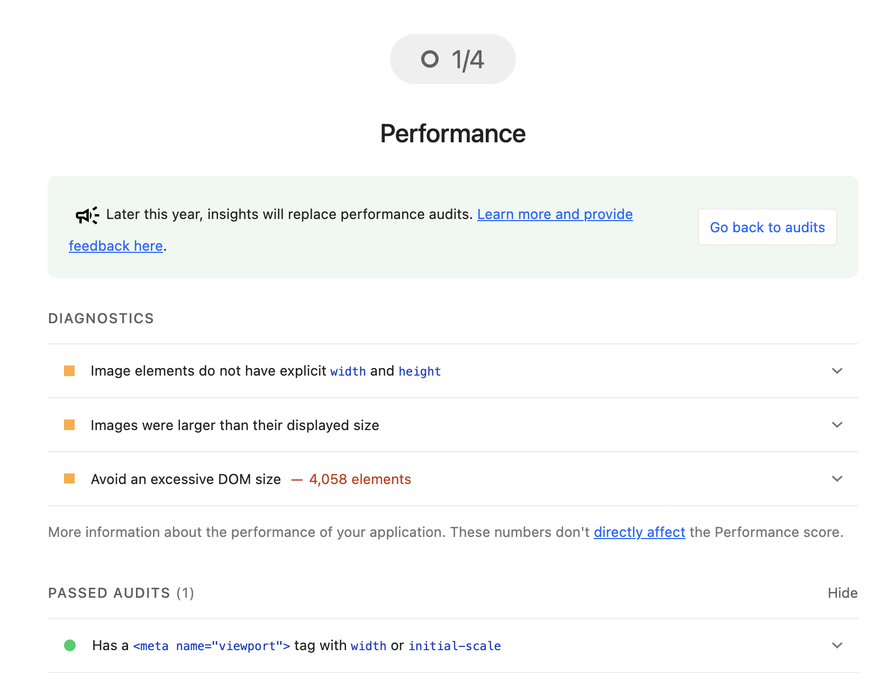

lo que nos está diciendo

- las imágenes son más grandes que el tamaño en el que se renderizan, esto tiene un costo para adaptar el ancho y alto
- "Avoid an excessive DOM size" -> estamos dibujando 4.058 elementos porque son 450 tareas lo que involucra un TR, varios TDs, las imágenes tienen divs, etc.

```html
<tr data-testid="tarea_7835554726608137">
  <td>Acer acquiro nesciunt appello corona.</td>
  <td id="fecha">31/10/2025</td>
  <td id="asignatario"></td>
  <td><div data-testid="alto" style="...">81%</div></td>
  <td></td>
</tr>
```

## Primer avance con la paginación

Pasaremos el **número de página** y **el tamaño de la página** o límite, dentro de los query params de la lista de tareas. Originalmente será 1 el número de página y 10 el tamaño de la lista.

```ts
// tareaService.ts
  async getTareas(paginationData: PaginationData): Promise<TareasPaginadas> {
    const tareasJson = await axios.get(`${REST_SERVER_URL}/tareas?page=${paginationData?.page || 1}&limit=${paginationData?.limit || 10}`)
    const tareasResult = tareasJson.data
    const tareas = tareasResult.data.map((tareaJson: TareaJSON) => Tarea.fromJson(tareaJson))
    return { tareas: tareas.sort((a: Tarea, b: Tarea) => a.descripcion < b.descripcion ? -1 : 1), hasMore: tareasResult.hasMore }
  }
```

Definimos paginationData como

```ts
export interface PaginationData {
  page: number,
  limit: number,
}
```

y el tipo de retorno como

```ts
export interface TareasPaginadas {
  hasMore: boolean // si hay más tareas para buscar
  tareas: Tarea[]
}
```

Ahora vemos que solo recibimos del back 10 tareas:

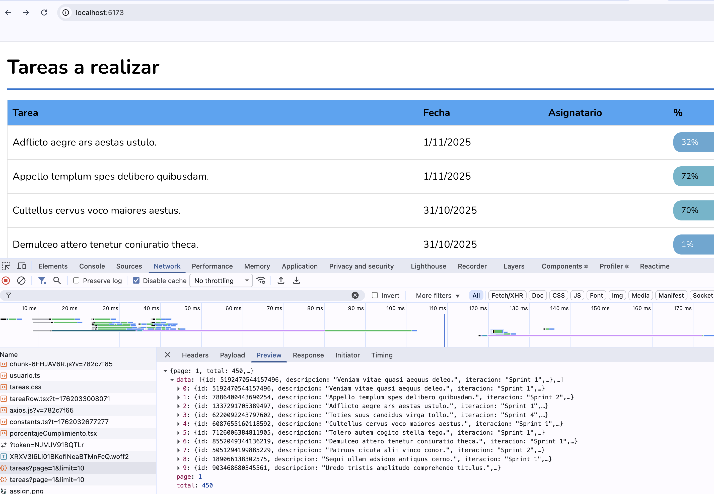

## Segundo avance: scroll dinámico

Lo que sigue es que podamos mostrar un botón para cargar dinámicamente más tareas. Veamos qué cambios son necesarios.

### Agregados en el estado

Necesitamos tener el número de la página como estado y además un booleano que nos indique si hay más elementos.

```tsx
  const [hasMore, setHasMore] = useState(false)
  const [page, setPage] = useState(1)
```

### Búsqueda inicial de tareas y búsqueda adicional

Inicialmente traeremos la primera página

```tsx
  const getTareas = async (newPage: number, init = false) => {
    try {
      const { tareas, hasMore} = await tareaService.getTareas({ page: newPage, limit: pageSize })
      setHasMore(hasMore)
      setTareas((oldTareas) => (init ? [] : oldTareas).concat(tareas))
    } catch (error: unknown) {
      const errorMessage = getMensajeError(error as ErrorResponse)
      showToast(errorMessage, 'error')
    }
  }

  const traerTareas = async () => {
    getTareas(page, true)
  }

  useOnInit(traerTareas)
```

Eso asigna la **primera lista** de tareas en el setTareas, por eso el condicional va por la lista vacía.

Cuando necesitemos buscar **más** tareas, avanzaremos una página, pero manteniendo la lista de tareas que teníamos actualmente, por eso el condicional por la rama falsa agrega las nuevas tareas a la lista anterior, para no perderlas.

```tsx
  const traerMasTareas = async () => {
    const newPage = page + 1
    getTareas(newPage)
    setPage(newPage)
  }
```

Un detalle: la asignación `setPage` **no modifica el estado inmediatamente**, por eso es necesario pasar una referencia a `newPage` con el valor incrementado, de lo contrario no va a funcionar correctamente.

### Cambios en la vista

Al buscar en el backend, recibimos la confirmación o no de que hay más tareas para traer:

```ts
const { tareas, hasMore} = await tareaService.getTareas({ page: newPage, limit: pageSize })
setHasMore(hasMore)
```

Ese estado `hasMore` lo utilizamos para el render condicional del botón que nos permite buscar más tareas:

```tsx
  ...

      {hasMore && <div>
        <button className='buttonRow secondary' onClick={traerMasTareas}>Ver más tareas</button>
      </div>}
```

## Nuevo reporte de Lighthouse

Todavía se sigue quejando de que

- hay [recursos críticos que bloquean el thread de UI](https://web.dev/learn/performance/understanding-the-critical-path?utm_source=lighthouse&utm_medium=devtools#render-blocking_resources)
- las imágenes utilizadas son grandes, y podríamos evitar el resize

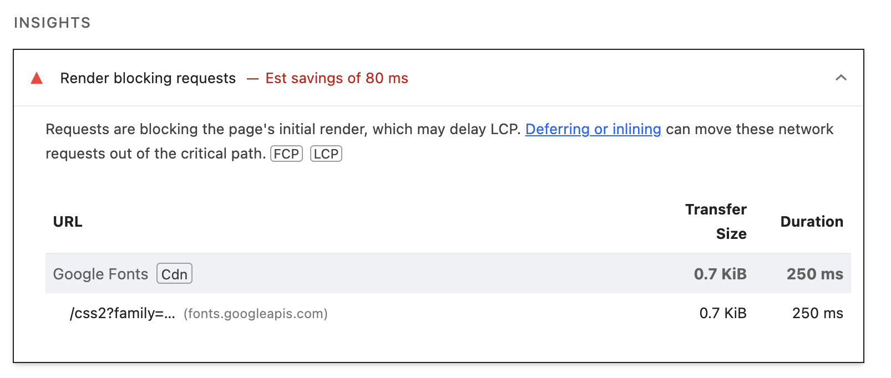

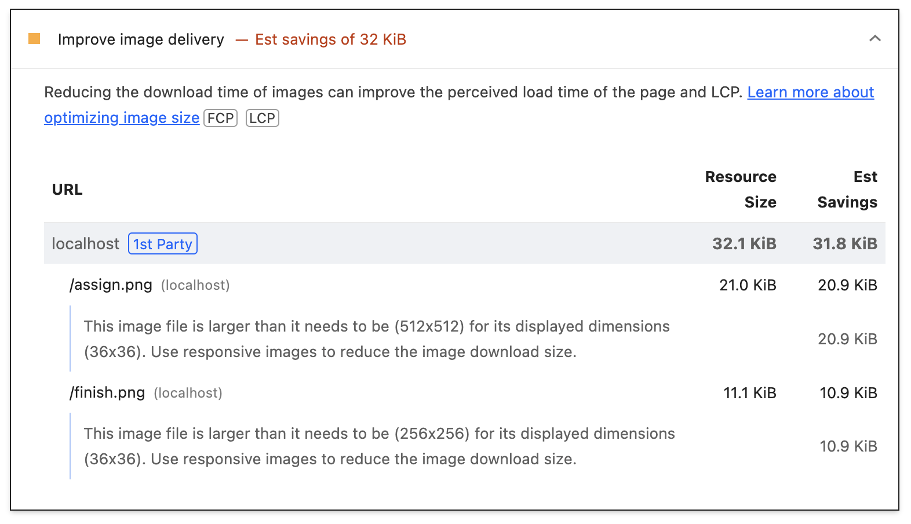

### Resize de las imágenes

Dado que ambas imágenes se muestran a 36 x 36, utilizamos algún programa (como [Gimp](https://www.gimp.org/)) para aplicar el resize por fuera del trabajo del navegador. Las grabamos con otro nombre (assignOk.png y finishOk.png) y renombramos los archivos referenciados en nuestros componentes React.

### Evitar recursos bloqueantes

El mensaje `Requests are blocking the page's initial render, which may delay LCP. Deferring or inlining can move these network requests out of the critical path.` nos habla de dos métricas importantes:

- **FCP** o First Content Paint, que mide el momento en que el usuario ve algo útil en la pantalla. Este contenido puede ser cualquier texto, imagen (incluyendo imágenes de fondo no definidas por CSS), o un elemento <svg> que se renderiza. Le indica al usuario que la página está comenzando a cargar. Un valor por debajo de los 1.8 segundos es considerado bueno (por Google) 
- **LCP** o Largest Content Paint, que mide la percepción de la velocidad de carga principal. Este elemento más grande suele ser el titular, la imagen principal, o el bloque de texto más destacado que capta la atención del usuario. Responde a la pregunta: "¿Qué tan rápido se cargó el contenido principal de la página?". Un valor por debajo de 2.5 segundos es considerado bueno (por Google)

Por lo que vemos, estamos en el umbral de lo "bueno", sin embargo fíjense que la medición de la performance ya no tiene que ver con nuestros componentes de React, sino con decisiones de cómo cargar el css y los fonts. Veamos el index.html:

```html
<html lang="en">
  <head>
    <meta charset="UTF-8" />
    <link rel="icon" type="image/svg+xml" href="/favicon.ico" />
    <link rel="preconnect" href="https://fonts.googleapis.com">
    <link rel="preconnect" href="https://fonts.gstatic.com" crossorigin>
    <link href="https://fonts.googleapis.com/css2?family=Nunito:ital,wght@0,200..1000;1,200..1000&display=swap" rel="stylesheet">
    <meta name="viewport" content="width=device-width, initial-scale=1.0" />
    <title>Tareas React</title>
  </head>
```

Pasamos a esta versión donde

- la opción `preconnect` ya la estamos usando y le da prioridad a la conexión con los fonts de Google. Si tenemos latencia en la red (demoras) o bien si queremos asegurarnos de tener mayor rapidez, podemos [descargar las fuentes localmente](https://fonts.google.com/knowledge/using_type/self_hosting_web_fonts), lo que le va a dar un mejor rendimiento
- después hacemos un truco: evitamos el bloqueo del thread del navegador utilizando el media=print, luego una vez que carga descargamos el font para todo tipo de uso. También evitamos descargar las variantes de Nunito para los grosores de 500, 600, 800, 900 y 1000 que no estamos usando

```html
<html lang="en">
  <head>
    <meta name="viewport" content="width=device-width, initial-scale=1.0" />
    <title>Tareas React</title>
    <link rel="icon" type="image/svg+xml" href="/favicon.ico" />
    <link rel="preconnect" href="https://fonts.googleapis.com">
    <link rel="preconnect" href="https://fonts.gstatic.com" crossorigin>
    <link 
      rel="preload" 
      as="style" 
      href="https://fonts.googleapis.com/css2?family=Nunito:ital,wght@400;1,700&display=swap"
    >
    <link 
      rel="stylesheet" 
      href="https://fonts.googleapis.com/css2?family=Nunito:ital,wght@400;1,700&display=swap"
      media="print" 
      onload="this.media='all'"
    >
  </head>
  </html>
```

Volvemos a correr el análisis de performance y vemos **que no se movió la aguja significativamente** (es más, puede que te de un poco peor inclusive). 

> Una conclusión que podemos extraer es que a la hora de atacar la performance lo importante es encontrar los cuellos de botella. Tratar de solucionar un problema que no tenemos puede hacer que empecemos a tener inconvenientes.

## Otros cambios importantes

### Cumplimiento de una tarea

Originalmente, marcar una tarea como cumplida tenía este comportamiento

```tsx
tareas.map((tarea) =>
  <TareaRow
    tarea={tarea}
    key={tarea.id}
    actualizar={traerTareas} />)
```

con lo que una vez cumplida, lo que hacíamos era refrescar la lista de tareas en base al backend:

```tsx
export const TareaRow = ({ tarea, actualizar }: { tarea: Tarea, actualizar: () => void }) => {

  const cumplirTarea = async () => {
    try {
      ...
    } finally {
      // viene como props
      await actualizar()
    }
  }
```

**Este comportamiento ya no nos sirve** porque traerTareas nos devuelve la lista de tareas pero únicamente con la página actual. En lugar de eso vamos a pedirle al backend que nos devuelva la tarea actualizada:

```ts
// tareaService
actualizarTarea(tarea: Tarea) {
  return axios.put(`${REST_SERVER_URL}/tareas/${tarea.id}`, tarea.toJSON())
}
```

Y ahora desde el componente principal vamos a pasarle a cada TareaRow una función que toma únicamente la tarea cumplida y regenera la lista que tiene en el estado actual:

```tsx
  const actualizarTarea = async (tareaActualizada: Tarea) => {
    const nuevasTareas = [...tareas]
    const indexTarea = nuevasTareas.findIndex((tareaSearch: Tarea) => tareaSearch.id == tareaActualizada.id)
    nuevasTareas[indexTarea] = tareaActualizada
    setTareas(nuevasTareas)
  }

  ...

            {
            tareas.map((tarea) =>
              <TareaRow
                tarea={tarea}
                key={tarea.id}
                actualizar={actualizarTarea} />)
```

De esa manera reemplazamos la lista original con una nueva lista que tiene la tarea cumplida en el mismo lugar.

## Una última mejora

TODO 2: definir tests de integración en node y tests de dominio
TODO 3: metemos React.Suspense y lazy loading a ver si mejora
