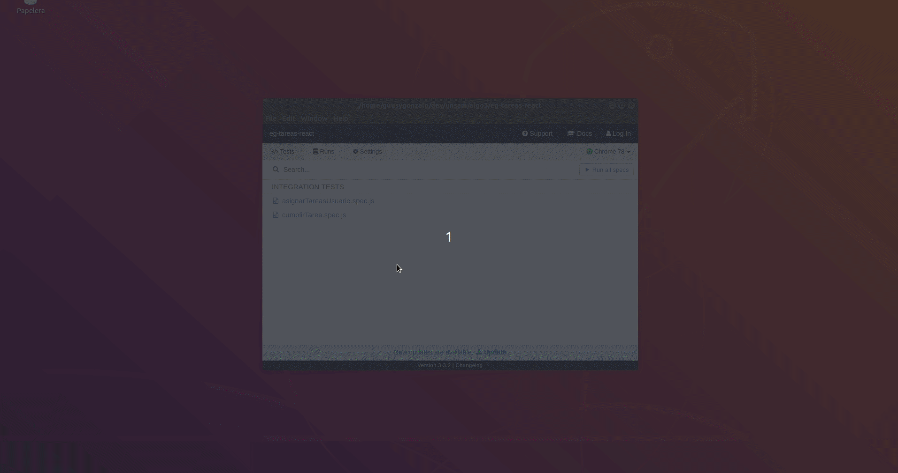

# Tareas de un equipo de desarrollo

[](https://travis-ci.org/uqbar-project/eg-tareas-react)


El ejemplo que muestra las tareas de un equipo de desarrollo, permite asignar, cumplir o modificar la descripción de una tarea.

# Conceptos

- Componentes de React
- Uso de componentes visuales de Material: select (combo), text field, snack bar (message box), tablas, entre otras
- React router que define un master / detail
- Uso de fetch para disparar pedidos asincrónicos tratados con promises
- Manejo del estado

# Arquitectura general

## Página principal: ver tareas


- **TareasComponent**: es el que sabe mostrar la tabla y delega en TareaRow la visualización de cada ítem
- **TareaRow**: conoce cómo mostrar una tarea dentro de una fila de la tabla
- **PorcentajeCumplimiento**: es un componente que muestra un avatar con el % de cumplimiento en diferentes colores. En rojo se visualizan las tareas cuyo % de cumplimiento es menor a 50, luego de 50 a 90% exclusive aparecen en amarillo y por último las que tienen 90% ó más se ven en verde.


El componente llama al service (singleton) quien dispara la búsqueda de tareas y devuelve la promise:

```javascript
>>>TareaService
 allInstances() {
  return fetch(`${REST_SERVER_URL}/tareas`)
}
```

Cuando el pedido vuelve con un estado ok, se actualiza el estado del componente React, transformando la lista de objetos JSON en objetos Tarea:

```javascript
>>>TareasComponent
componentDidMount() {
  this.actualizarTareas()
}

actualizarTareas = () => {
  tareaService.allInstances()
    .then((tareas)=>{
      this.setState({
        tareas: tareas
      })
    })
    .catch((error) => {
      this.errorHandler(error)
    })
}
```

Se encadenan las promises mediante la función then, y se atrapa cualquier excepción dentro del catch.

O utilizando la sintaxis async / await esto se transforma en:

```js
actualizarTareas = async () => {
  try {
    const tareas = await tareaService.allInstances()
    this.setState({
      tareas: tareas
    })
  } catch (error) {
    this.errorHandler(error)
  }
}
```

Y por que no un método comun de clase y si una lambda ? :thinking:

Si quisiéramos usar un método, lo que deberíamos  hacer dentro del constructor el `this` del componente, ya que el `this` que está tomando es del método, por lo tanto no tendríamos acceso a `this.setState` o `this.state` que son propios de la clase de react de la cual extendemos.

```javascript
constructor(props) {
  super(props)
  this.state = { tareas: [] }
  this.actualizarTareas =  this.actualizarTareas.bind(this)
}
```

Por lo tanto hacemos uso de una lambda, ya que no crea su propio `this` y utiliza el del contexto donde está declarado, en este caso para nosotros es el componente de react

## Cumplir una tarea

El componente captura el evento del botón:

```javascript
>>>TareaRow
<IconButton aria-label="Cumplir" onClick={cumplirTarea}>
    <CheckCircleIcon />
</IconButton>
```

En ese evento se delega a cumplir de Tarea y se pide al service que actualice el backend. Cuando la promise se cumple, disparamos la función que nos pasaron por props y a buscar nuevamente las tareas al backend, para traernos la ultima información:

```javascript
>>>TareaRow
const cumplirTarea = async () => {
    tarea.cumplir()
    try {
      await tareaService.actualizarTarea(tarea)
      props.actualizar()
    } catch (error) {
      console.log(error)
    }
}
```

El método actualizarTarea del service dispara el método PUT:

```javascript
actualizarTarea(tarea) {
  return fetch(`${REST_SERVER_URL}/tareas/${tarea.id}`, {
    method: 'put',
    body: JSON.stringify(tarea.toJSON())
  })
}
```

El botón de asignación dispara la navegación de la ruta '/asignar':

```javascript
>>>TareaRow
const goToAsignarTarea = () => {
  props.history.push(`/asignarTarea/${tarea.id}`)
}
<IconButton aria-label="Asignar" onClick={goToAsignarTarea}>
    <AccountBoxIcon />
</IconButton>
```

para lo cual hay que decorar el componente TareaRow con el router de React:

```javascript
export default withRouter(TareaRow)
```

Esto permite que se le inyecte dentro del mapa `props` la referencia `history` que guarda la lista de URLs visitadas y además maneja la navegación de la SPA. Podemos utilizar el mismo history para volver a la página anterior con `props.history.goBack()`. Para más información pueden ver [esta página del Router de React](https://reacttraining.com/react-router/core/guides/philosophy).

## Asignación de tareas


En la asignación de tareas el combo de usuarios se llena con una llamada al servicio REST que trae los usuarios:

```javascript
>>>UsuarioService
 async allInstances() {
  const response = await fetch(`${REST_SERVER_URL}/usuarios`)
  const usuariosJson = await response.json()
  return usuariosJson
}
```

Agregamos en el combo la opción "Sin Asignar":

```javascript
<Select
    value={this.state.tarea.nombreAsignatario}
    onChange={(event) => this.asignar(event.target.value)}
    className="formControl"
    inputProps={{
        name: 'asignatario',
        id: 'asignatario'
    }}
>
    >
        <MenuItem value=" ">
        <em>Sin Asignar</em>
    </MenuItem>
    {this.state.usuarios.map(usuario => <MenuItem value={usuario.nombre} key={usuario.id}>{usuario.nombre}</MenuItem>)}
</Select>
```

La clase formControl especifica un width más grande (el default es muy chico), en el archivo index.css:

```css
.formControl {
  width: 35rem;
  min-width: 35rem;
}
```

Para entender cómo funciona la asignación, el combo dispara el evento de cambio al componente AsignarTareas:

```javascript
... onChange={(event) => this.asignar(event.target.value)}
```

El método asignar recibe el nombre del nuevo asignatario (podríamos recibir el identificador, pero lamentablemente el servicio REST solo nos da el nombre), entonces delegamos a un método más general que actualiza el estado de la tarea:

```javascript
>>>AsignarTareaComponent
asignar(asignatario) {
    this.cambiarEstado((tarea) => tarea.asignarA(asignatario))
}

cambiarEstado(closureChange) {
    const tarea = this.state.tarea
    closureChange(tarea)
    this.setState({
        tarea: tarea,
        errorMessage: ''
    })
}
```

### Un pequeño párrafo para el spread operator

El lector habrá notado esta línea:

```js
this.setState({
    ...this.state,
```

lo que se conoce como _spread operator_, un _syntactic sugar_ que permite expandir un objeto con sus propiedades sin tener que definir explícitamente sus atributos. En el caso de que el estado tuviera además de la tarea otras 4 referencias (ref1, ref2, ref3, ref4), nos evita hacer

```js
this.setState({
    ref1: this.state.ref1,
    ref2: this.state.ref2,
    ref3: this.state.ref3,
    ref4: this.state.ref4,
    tarea: tarea,
    ...
})
```

Ya que recordemos que el estado es inmutable, solo podemos generar un **nuevo** estado en base al actual.

Para más información pueden consultar [esta página](https://developer.mozilla.org/es/docs/Web/JavaScript/Referencia/Operadores/Spread_operator).

### Continuamos actualizando el estado del componente que asigna una tarea

Al actualizar el estado se dispara el render que refleja el nuevo valor para el combo, y tenemos entonces siempre la tarea actualizada.

Cuando el usuario presiona el botón Aceptar, se dispara el evento asociado que delega la actualización al service y regresa a la página principal.

```javascript
>>>AsignarTareaComponent
async asignarTarea() {
    try {
        this.state.tarea.validarAsignacion()
        await tareaService.actualizarTarea(this.state.tarea)
        this.volver()
    } catch (e) {
        this.generarError(e)
    }
}
```

Se delega la validación en la tarea directamente. Pueden ver la implementación en el código.

# Testing

Ahora que separamos todo en componentes más chicos y con menos responsabilidades, son mucho más fáciles de testear :tada:

### TareaRow

A este componente le pasamos una tarea por `props` y basándonos en los diferentes estados de la misma hacemos lo siguiente:
- si está asignada nos aparece el botón que permite marcarla como cumplida
- si está asignada pero su porcentaje de cumplimiento está completo no aparece el está de cumplir
- cuando tocamos el está de asignar nos redirige hacia otra página
- si no está asignada no aparece dicho botón

```javascript
describe('TareaRow', () => {
    describe('cuando una tarea está asignada', () => {
        let tareaAsignada
        beforeEach(() => {
            tareaAsignada = crearTarea(159, 'Construir test TODO List', 0, 'Marcos Rojo')
        })
        it('puede cumplirse', () => {
            const componente = shallow(<TareaRow tarea={tareaAsignada} />)
            expect(existeCumplir(componente, tareaAsignada.id)).toBeTruthy()
        })
        describe('si su porcentaje de cumplimiento está completo', () => {
            it('NO se puede asignar', () => {
                tareaAsignada.porcentajeCumplimiento = 100
                const componente = shallow(<TareaRow tarea={tareaAsignada} />)
                expect(existeAsignacion(componente, tareaAsignada.id)).toBeFalsy()
            })
        })
        describe('si su porcentaje de cumplimiento NO está completo', () => {
            it('se puede asignar', () => {
                tareaAsignada.porcentajeCumplimiento = 50
                const componente = shallow(<TareaRow tarea={tareaAsignada} />)
                expect(existeAsignacion(componente, tareaAsignada.id)).toBeTruthy()
            })
            it('y se clickea el botón de asignación, nos redirige a la ruta de asignación con el id', () => {
                tareaAsignada.porcentajeCumplimiento = 50
                const pushEspia = jest.fn()
                const componente = shallow(
                    <TareaRow
                        tarea={tareaAsignada}
                        history={{ push: pushEspia }}
                    />)
                botonAsignacion(componente, tareaAsignada.id).simulate('click')
                expect(pushEspia).toBeCalledWith(`/asignarTarea/${tareaAsignada.id}`)

            })
        })
    })

    describe('cuando una tarea NO está asignada', () => {
        it('una tarea sin asignar no puede cumplirse', () => {
            const tareaNoAsignada = crearTarea(159, 'Construir test TODO List', 0, 'Marcos Rojo')
            tareaNoAsignada.desasignar()
            const componente = shallow(<TareaRow tarea={tareaNoAsignada} />)
            expect(existeCumplir(componente, tareaNoAsignada.id)).toBeFalsy()
        })
    })
})
```

Acá podemos ver el uso de la función `beforeEach`, que lo que hace es ejecutarse cada vez que va a correr un test, nosotros la aprovechamos para tener una tarea nueva cada vez que corramos cada test, asi nos aseguramos que no hay estado compartido entre los diferentes tests :hearth:

Y hacemos uso de un par de funciones auxiliares para no repetir código entre nuestros tests: 
```javascript
const botonAsignacion = (componente, id) => componente.find(`#asignar_${id}`)
const existeAsignacion = (componente, id) => botonAsignacion(componente, id).exists()
const existeCumplir = (componente, id) => componente.find(`#cumplir_${id}`).exists()
```


### Tareas

## Mockear el servicio

La parte más interesante de los tests es cómo hacemos para interceptar las llamadas a nuestros **services**, lo primero es crear nuestros datos de mock

```javascript
function crearTarea(id, descripcion, porcentaje, asignado) {
  const result = new Tarea()
  result.id = id
  result.descripcion = descripcion
  result.porcentaje = porcentaje
  result.asignatario = new Usuario(asignado)
  return result
}

const construirTest = crearTarea(159, "Construir test TODO List", 0, "Marcos Rojo")

const mockTareas =
  [
    crearTarea(68, "Desarrollar TODO List en React", 75, "Paula Paretto"),
    construirTest
  ]
```

Y ahora sí podemos construir una _promise mockeada_, dentro de nuestros tests :

Ya que nuestro servicio de tareas es un singleton, podríamos pisar el método en el contexto de los tests haciendo que devuelva una promesa con lo que nosotros queramos directamente, de la siguiente manera :

```javascript
tareaService.allInstances = () => Promise.resolve(mockTareas)
```

Y nuestro test quedaría de la siguiente forma :

```javascript
describe('TareasComponent', () => {
  describe('cuando el servicio respode correctamente', () => {
    it('se muestran las tareas en la tabla', () => {
      tareaService.allInstances = () => Promise.resolve(mockTareas)
      const componente = shallow(<TareasComponent />)
      setImmediate(() => {
        expect(componente.find('#tarea_159').exists()).toBeTruthy()
        expect(componente.find('#tarea_68').exists()).toBeTruthy()
      })
    })
  })
})
```

Tenemos que usar un `setImmediate` para esperar a que nuestro componente termine de renderizar el jsx y ahí nosotros poder buscar las tareas


## Cypress

Nos interesa testear 2 flujos de nuestra aplicación:
- Cumplir una tarea
- Asignar una tarea a una persona

En esta app, tenemos una comunicación con el [backend](https://github.com/uqbar-project/eg-tareas-xtrest), entonces deberíamos levantarlo para poder comunicarnos correctamente.

Vamos con nuestro primer test:

```javascript
describe('Cumplir una tarea', () => {
    before(()=>{
        cy.visit('/')
    })

    it('cuando clickeamos en el boton cumplir', () => {
        cy.get(getDataTestId('cumplir_3')).click()
    })

    it('se pasa al porcentaje del cumplimiento 100%',()=>{
        cy.get(getDataTestId('3_porcentaje_100')).click()
    })
})
```

Buenisimo, lo corremos y da verde, pero si lo volvemos a correr.... falla !



¿Y por que pasa esto ? 
Por que nuestro backend, maneja datos y una vez que los cambiamos quedan así para siempre, deberíamos tirar y volver a levantar para ver los datos limpios.

Entonces.... ¿que hacemos ? 

Bueno para evitar estos problemas en los tests E2E tenemos varias estrategias.

- Si nuestro backend estuviese conectado a una base de datos, podríamos recrear datos de prueba antes de correr los tests (crear estos datos de prueba puede llegar a generar ciertas complicaciones).

- Poner una capa antes del backend la cual podemos mockear dinámicamente (solo para los tests), esto por lo general se denomina [mock-server](http://www.mock-server.com/)

- Cypress nos provee una manera de interceptar los requests salientes del navegador para nosotros poder mockearlas.

Vamos a optar por la manera de cypress: 
```javascript
const tarea = {
    'id' : 3,
    'descripcion' : 'Desarrollar componente de envio de mails',
    'iteracion' : 'Iteración 1',
    'porcentajeCumplimiento' : 0,
    'new' : false,
    'fecha' : '14/11/2019',
    'asignadoA':'Rodrigo Grisolia'
}
describe('Cumplir una tarea', () => {
    before(()=>{
        // iniciamos el server de mock
        cy.server()
        // mockeamos el GET de tareas
        cy.route('/tareas', [ tarea ])
        cy.visit('/')
    })

    it('cuando clickeamos en el boton cumplir', () => {
        cy.server()
        // volvemos a mockear el GET /tareas, pero esta vez con la tarea completa al 100%
        cy.route('/tareas', [ {...tarea, porcentajeCumplimiento:100} ])
        // Tambien tenenemos que mockear el PUT de modificar la tarea
        cy.route({url:`/tareas/${tarea.id}`, status:200, response:{}, method:'PUT'})
        cy.get(getDataTestId('cumplir_3')).click()
    })

    it('se pasa al porcentaje del cumplimiento 100%',()=>{
        cy.get(getDataTestId('3_porcentaje_100')).click()
    })
})
```

Aparecen nuevos conceptos :

[cy.server()](https://docs.cypress.io/api/commands/server.html) => Nos habilita el uso de `cy.route`

[cy.route()](https://docs.cypress.io/api/commands/route.html) => Podemos mockear cualquier request 

Y nuestro flujo de asignación :
```javascript
/// <reference types="Cypress" />
const getDataTestId = (value) => `[data-testid=${value}]`
const asignarButton = (id) => getDataTestId(`asignar_${id}`)
const tarea = {
    'id' : 1,
    'descripcion' : 'Desarrollar componente de envio de mails',
    'iteracion' : 'Iteración 1',
    'porcentajeCumplimiento' : 0,
    'new' : false,
    'fecha' : '14/11/2019'
  }
describe('Asignar tarea a usuario', () => {
    before(() => {
        cy.server()
        //obtenemos los datos del fixture/usuarios.json
        return cy.fixture('usuarios')
        .then(usuarios => {
            //mockeamos a los usuarios
            cy.route('/usuarios', usuarios)
            // mockeamos las tareas
            cy.route('/tareas',[ tarea ])
            // mockeamos el detalle de una tarea
            cy.route('/tareas/1',tarea)

        })
    })

    it('cuando clickeamos en el boton cumplir', () => {
        cy.visit('/')
        cy.get(asignarButton(1)).click()
    })

    it('nos redirije a la pagina de asignacion',()=>{
        cy.url().should('include', '/asignarTarea/1')
    })

    it('seleccionamos un usuario',()=>{
        cy.get(getDataTestId('select-asignar')).click()
        cy.get('[data-value="Rodrigo Grisolia"]').click()
    })
    
    it('tocamos aceptar y nos devuelve a la home',()=>{
        cy.server()
        // mockeamos las tareas con la tarea asignada
        cy.route('/tareas', [ {...tarea , asignadoA:'Rodrigo Grisolia'} ])
        cy.get(getDataTestId('aceptar-asignacion')).click()
        cy.url().should('eq', 'http://localhost:3000/')
    })

    it('y el usuario queda asignado',()=>{
        cy.get(getDataTestId('nombre-asignatario_1')).contains('Rodrigo Grisolia')
    })
})
```

[cy.fixture()](https://docs.cypress.io/api/commands/fixture.html) => Nos permite tener el contenido de los archivos de mocks que creamos dentro de **cypress/fixtures** y lo hace forma asíncrona, así que tenemos que tratarlo como una promesa