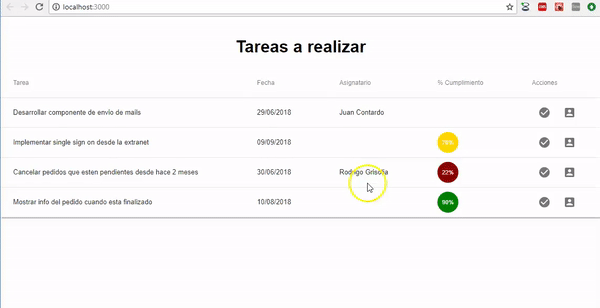

# Tareas de un equipo de desarrollo



El ejemplo que muestra las tareas de un equipo de desarrollo, permite asignar, cumplir o modificar la descripción de una tarea.

# Conceptos

- Componentes de React
- Uso de componentes visuales de Material: select (combo), text field, snack bar (message box), tablas, entre otras
- React router que define un master / detail
- Uso de fetch para disparar pedidos asincrónicos tratados con promises
- Manejo del estado

# Arquitectura general

## Página principal: ver tareas


- **TareasComponent**: es el que sabe mostrar la tabla y delega en TareaRow la visualización de cada ítem
- **TareaRow**: conoce cómo mostrar una tarea dentro de una fila de la tabla
- **PorcentajeCumplimiento**: es un componente que muestra un avatar con el % de cumplimiento en diferentes colores. En rojo se visualizan las tareas cuyo % de cumplimiento es menor a 50, luego de 50 a 90% exclusive aparecen en amarillo y por último las que tienen 90% ó más se ven en verde.


El componente llama al service quien dispara la búsqueda de tareas y devuelve la promise:

```javascript
>>TareaService
allInstances() {
  return fetch(REST_SERVER_URL + "/tareas")
}
```

Cuando el pedido vuelve con un estado ok, se actualiza el estado del componente React, transformando la lista de objetos JSON en objetos Tarea:

```javascript
>>>TareasComponent
constructor(props) {
    super(props)
    tareaService.allInstances()
        .then((res) => res.json())
        .then((tareasJson) => {
            this.setState({
                tareas: tareasJson.map((tareaJson) => Tarea.fromJson(tareaJson))
            })
        })
        .catch(this.errorHandler)
}
```

Se encadenan las promises mediante la función then, y se atrapa cualquier excepción dentro del catch.

## Cumplir una tarea

El componente captura el evento del botón:

```javascript
>>>TareaRow
<IconButton aria-label="Cumplir" onClick={(event) => this.cumplirTarea(tarea)}>
    <CheckCircleIcon />
</IconButton>
```

En ese evento se delega a cumplir de Tarea y se pide al service que actualice el backend. Cuando la promise se cumple, disparamos la actualización del estado para renderizar los cambios en la vista:

```javascript
>>>TareaRow
cumplirTarea(tarea) {
    tarea.cumplir()
    tareaService.actualizarTarea(tarea).then(
        () => this.setState({
            tarea: tarea
        })
    )
}
```

El método actualizarTarea del service dispara el método PUT:

```javascript
actualizarTarea(tarea) {
  return fetch(REST_SERVER_URL + "/tareas/" + tarea.id, {
    method: 'put',
    body: JSON.stringify(tarea.toJSON())
  })
}
```

El botón de asignación dispara la navegación de la ruta '/asignar':

```javascript
>>>TareasComponent
<IconButton aria-label="Asignar" onClick={() => this.props.history.push('/asignarTarea/' + tarea.id)}>
    <AccountBoxIcon />
</IconButton>
```

para lo cual recordemos que hay que decorar el componente TareasComponent con el router de React:

```javascript
export default withRouter(TareasComponent)
```

## Asignación de tareas


En la asignación de tareas el combo de usuarios se llena con una llamada al servicio REST que trae los usuarios:

```javascript
>>>UsuarioService
allInstances() {
  return fetch(REST_SERVER_URL + "/usuarios")
}
```

Agregamos en el combo la opción "Sin Asignar":

```javascript
<Select
    value={this.state.tarea.nombreAsignatario()}
    onChange={(event) => this.asignar(event.target.value)}
    className="formControl"
    inputProps={{
        name: 'asignatario',
        id: 'asignatario'
    }}
>
    >
        <MenuItem value=" ">
        <em>Sin Asignar</em>
    </MenuItem>
    {this.state.usuarios.map(usr => <MenuItem value={usr.nombre} key={usr.id}>{usr.nombre}</MenuItem>)}
</Select>
```

La clase formControl especifica un width más grande (el default es muy chico), en el archivo index.css:

```css
.formControl {
  width: 35rem;
  min-width: 35rem;
}
```

Para entender cómo funciona la asignación, el combo dispara el evento de cambio al componente AsignarTareas:

```javascript
... onChange={(event) => this.asignar(event.target.value)}
```

El método asignar recibe el nombre del nuevo asignatario (podríamos recibir el identificador, pero lamentablemente el servicio REST solo nos da el nombre), entonces delegamos a un método más general que actualiza el estado de la tarea:

```javascript
>>>TareasComponent
asignar(asignatario) {
    this.cambiarEstado((tarea) => tarea.asignarA(asignatario))
}

cambiarEstado(closureChange) {
    const tarea = this.state.tarea
    closureChange(tarea)
    this.setState({
        ...this.state,
        tarea: tarea,
        errorMessage: ""
    })
}
```

Al actualizar el estado se dispara el render que refleja el nuevo valor para el combo, y tenemos entonces siempre la tarea actualizada.

Cuando el usuario presiona el botón Aceptar, se dispara el evento asociado que delega la actualización al service y regresa a la página principal.

```javascript
>>>TareasComponent
asignarTarea() {
    if (this.state.tarea.nombreAsignatario().trim() === "") {
        this.generarError("Debe asignar la tarea a una persona")
        return
    }
    tareaService.actualizarTarea(this.state.tarea)
        .then(() => this.volver())
        .catch((e) => this.generarError("Error en la actualización de la tarea: " + e))
}
```

Cosas para mejorar a futuro: podríamos delegar la validación en la tarea directamente.

# Testing

TODO